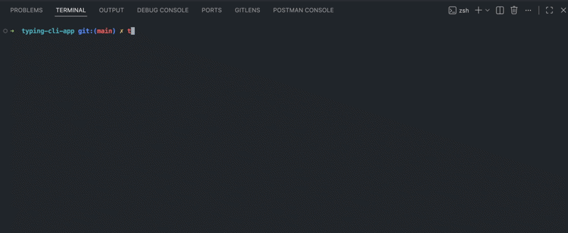

# ⌨️ Speed Typing CLI App

A simple terminal-based application to improve typing speed and accuracy, built with the Textual framework.

This project was created to solve a personal need: warming up my fingers before coding and improving my typing speed without leaving the terminal. It keeps practice fast, simple, and fully integrated into the development environment.

---

## 🎥 Demo



---

## 🚀 Features

- Practice typing directly in the terminal
- Real-time feedback on typing accuracy
- Lightweight and fast
- Clean terminal UI built with Textual

---

## 🛠️ Tech Stack

- Python
- Textual
- CSS (Textual styles)

---

## ⚙️ Installation

### Requirements

Make sure Python is installed on your system:

```bash
python --version
```

Expected output example:

```bash
Python 3.13.1
```

If Python is not installed, download it from:

https://www.python.org/downloads/

---

### Clone the repository

```bash
git clone https://github.com/tehuanmelo/speed-typing-cli-app.git
cd speed-typing-cli-app
```

---

### Create a virtual environment

#### macOS / Linux

```bash
python3 -m venv .venv
source .venv/bin/activate
```

#### Windows

```bash
python -m venv .venv
.venv\Scripts\activate
```

---

### Install dependencies

```bash
pip install -r requirements.txt
```

---

## ▶️ Usage

Run the application:

```bash
# macOS / Linux
python3 main.py

# Windows
python main.py
```

---

### ⚡️ Quick Start

### Mac

```bash
git clone https://github.com/tehuanmelo/speed-typing-cli-app.git
cd speed-typing-cli-app
python3 -m venv .venv
source .venv/bin/activate
pip install -r requirements.txt
python3 main.py
```

### Windows

```bash
git clone https://github.com/tehuanmelo/speed-typing-cli-app.git
cd speed-typing-cli-app
python3 -m venv .venv
.venv\Scripts\activate
pip install -r requirements.txt
python main.py
```

## 📁 Project Structure

```bash
.
├── data
│   └── data.py
├── images
│   └── demo-typing.gif
├── main.py
├── main.tcss
├── README.md
└── requirements.txt
```

---

## 🎯 Purpose of the Project

This project was built as a practical tool to:

- Warm up before coding sessions
- Improve typing speed and accuracy
- Stay focused inside the terminal
- Practice consistently without distractions

---

## 📚 Learning Process

While building this application, I improved my skills in:

- Structuring a Python project
- Working with the Textual framework
- Building terminal user interfaces (TUI)
- Handling real-time user input

---

## 🔮 Future Improvements

- Add typing speed metrics to a database or JSON file
- Add difficulty levels
- Improve UI/UX

---

## 👨‍💻 Author

**Tehuan Melo**  
Python Developer | Jiu-Jitsu Coach

---

Simple, practical, and built for real use 🚀